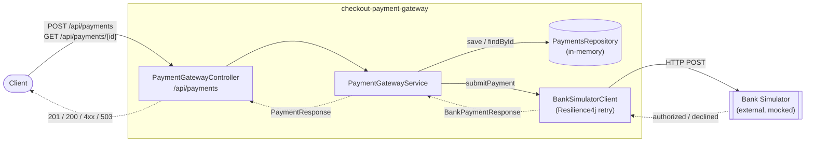

# Checkout.com Payment Gateway

An API-based payment gateway built with Spring Boot 4.1.0 and Java 21 to process card payments through a simulated acquiring bank.

## Tech Stack

| Technology | Purpose | Version |
|---|---|---|
| Java | Language | 21 |
| Spring Boot | Application framework | 4.1.0 |
| Spring MVC | REST API layer | managed by Spring Boot |
| Spring Validation | Bean Validation (JSR-380) | managed by Spring Boot |
| Resilience4j | Retry on transient bank failures | 2.3.0 |
| springdoc-openapi | Swagger / OpenAPI UI | 2.8.6 |
| REST Assured | Integration test HTTP client | 5.5.0 |
| WireMock | HTTP mock server for tests | 3.10.0 |
| Maven | Build tool | (wrapper included) |

## Quick Start

### 1. Start the Bank Simulator
```bash
docker-compose up -d
```

### 2. Run the Application
```bash
./mvnw spring-boot:run
```
The server starts on port `8090` by default.

### 3. Run All Tests
To execute all the tests (both unit and integration tests) in the project, run:
```bash
./mvnw clean test
```

## API Documentation
Once running, the Swagger UI is available at:  
[http://localhost:8090/swagger-ui/index.html](http://localhost:8090/swagger-ui/index.html)

## Endpoints

* **POST `/api/payments`**: Initiates a new payment.
  * _Headers_: `X-Idempotency-Key` (Optional, to prevent duplicate requests).
* **GET `/api/payments/{id}`**: Retrieves a previously made payment by UUID (returning masked card details).

## Architecture



**Request flow (`POST /api/payments`)**

1. `PaymentGatewayController` validates the incoming `PaymentRequest` (Bean Validation) and reads the optional `X-Idempotency-Key` header.
2. `PaymentGatewayServiceImpl` checks its in-memory idempotency cache — if the key was already processed, the cached `PaymentResponse` is returned immediately.
3. Otherwise, it calls `BankSimulatorClient`, which maps the request to a `BankPaymentRequest` and posts it to the bank simulator over HTTP, retrying transient failures (see [Retry Behavior](#retry-behavior)).
4. The bank's `authorized`/`authorization_code` response is mapped to a `PaymentStatus` (`AUTHORIZED` / `DECLINED`), the card number is masked to its last 4 digits, and the result is persisted in `PaymentsRepository`.
5. The response is cached against the idempotency key (if provided) and returned to the client.

`GET /api/payments/{id}` skips the bank/idempotency steps and reads directly from `PaymentsRepository`.

## Retry Behavior

Calls to the acquiring bank simulator are wrapped in a [Resilience4j](https://resilience4j.readme.io/) retry (`BankSimulatorRetryConfig`) so that a temporarily unhealthy bank does not immediately fail a payment.

**What is retried** — only transient failures:

* `503 Service Unavailable` from the bank (surfaced as `BankUnavailableException`)
* Connection/read timeouts (`ResourceAccessException`)

**What is _not_ retried** — anything that represents a definitive answer:

* Successful responses, including declined payments (`authorized: false`)
* `4xx` client errors (e.g. a malformed request)

After all attempts are exhausted, the original exception propagates and the caller receives `503 Service Unavailable`.

### Configuration

Retry settings are externalized in `application.properties` and can be tuned without code changes:

```properties
bank.simulator.retry.max-attempts=3          # total attempts, including the first call
bank.simulator.retry.initial-interval-ms=500 # wait before the first retry
bank.simulator.retry.backoff-multiplier=2    # exponential backoff factor
```

With the defaults, a persistently unavailable bank is tried 3 times with waits of 500 ms and 1000 ms between attempts. Each retry is logged at `WARN`.

## Usage Examples

### 1. Happy Path Payment Request

**Request**
```http
POST http://localhost:8090/api/payments
Content-Type: application/json
X-Idempotency-Key: 123e4567-e89b-12d3-a456-426614174000

{
  "cardNumber": "2222405343248877",
  "expiryMonth": 12,
  "expiryYear": 2030,
  "currency": "GBP",
  "amount": 1050,
  "cvv": "123"
}
```

**Response (`201 Created`)**
```json
{
  "id": "8b375b48-18e3-4de7-91a5-8e7cffc82bbd",
  "status": "Authorized",
  "cardNumberLastFour": "8877",
  "expiryMonth": 12,
  "expiryYear": 2030,
  "currency": "GBP",
  "amount": 1050
}
```

### 2. Non-Happy Path (Validation Failure)

If invalid request data is sent (e.g., negative amount, invalid CVV format):

**Request**
```http
POST http://localhost:8090/api/payments
Content-Type: application/json

{
  "cardNumber": "2222405343248877",
  "expiryMonth": 12,
  "expiryYear": 2030,
  "currency": "GBP",
  "amount": -50,
  "cvv": "ab"
}
```

**Response (`400 Bad Request`)**
```json
{
  "message": "Validation failed",
  "errors": {
    "amount": "Amount must be a positive integer",
    "cvv": "CVV must be 3 or 4 characters"
  }
}
```
